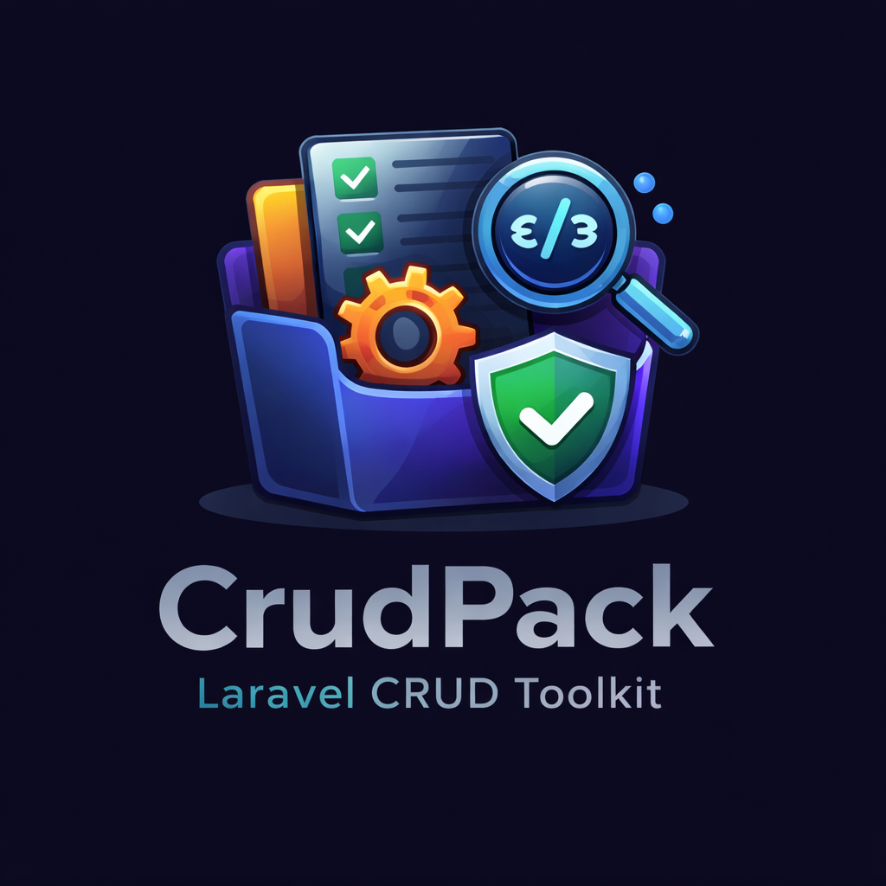

<!-- # Changelog

All notable changes to this project will be documented in this file.

The format is based on [Keep a Changelog](https://keepachangelog.com/en/1.1.0/),
and this project adheres to [Semantic Versioning](https://semver.org/).

--- -->

<p align="left">
  
</p>

## [0.1.0] - Initial Release

### Added
- Single Artisan command `crud:make` for CRUD generation
- Support for Web and API controllers
- Mandatory controller type and soft-delete mode selection
- Optional generators:
  - Routes (web/api)
    - For api routes (``` routes/api.php ```): Ready API documentation Postman collection (.json) is being created (and also updated) when creating a new api resource. When the developer creates another api resource then this api resource will be automatically appended to the created Postman collection to be ready for import in Postman as an API end-points (path: ``` postman/CrudPack.postman_collection.json ```)
  - Eloquent model
  - Migration
  - Form request (store + update)
    - The same form request (e.g., ProductRequest) will work for the request validation for both methods (store & update)
  - Policy
  - Blade views (Web only)
    - Ready-blades with responsive design for the CRUD operations for any created resource with also a ready-logic within those blades UI/UX is handled
    - Displaying the total count of the rows per resource in the Ready-blades (e.g., Products (73), Trashed (18), etc.)
    - The blades are **fully dynamic per resource**, they **respect policy-style** (authorization style) automatically
      - Blades: ``` index ```, ``` show ```, ``` create ```, ``` edit ```, ``` trash ```
      - Authorization styles: ``` none ``` (default), ``` authorize ```, ``` gate ```, ``` resource ```
    - Added placeholder authentication section in ``` resources/views/layouts/navigation.blade.php ``` [including authenticated user and unauthenticated user (guest)]. They’re currently commented out to support projects without authentication. If authentication is later added (e.g., Breeze or Jetstream with Fortify, UI, custom authentication, etc.), you can simply uncomment them.
  - Ready-blade pagination components (Bootstrap 5, Bootstrap 4, tailwind, default, etc.)
- Shared delete-handling trait generated once per application
- Soft delete workflows:
  - Trashed listing (partially deleted resources)
  - Restore (single & bulk)
  - Force delete (single & bulk)
- Bulk delete support
- Blueprint-first design (no hidden logic, no magic)
- Bootstrap 5–based Blade views
- Interactive wizard mode
- Full Laravel naming convention compliance
- Compatibility with PHP 8.0+ and Laravel 8.0+

### Notes
- This is the first stable release.
- All generated code is intended to be edited and customized by developers.
---

> [!NOTE]
> ## **Attention❗**
> This is important, but you can read it later.
>
> **Let’s jump to the core topic:**

## 👉 **[CLICK HERE](#get-started)**

### Some considerations needs to be addressed (optional you could read later):

#### API scaffold safety for Laravel 11+
- When generating ``` --api ``` resources, CrudPack ensures API routing is available by running Laravel’s php artisan ``` install:api ``` *only if* routes/api.php does not exist.
- If ``` routes/api.php ``` already exists, CrudPack *skips* running **install:api** silently (no prompt, no overwrite risk). This keeps the API scaffolding a **one-time setup step** per project.

- Note (**Laravel 11+**): ``` routes/api.php ``` and API route registration (inside **bootstrap\app.php**) are **not included** or **not registered by default** in a fresh Laravel project install. API routing is now “optional scaffolding”, so the first --api generation may need to scaffold it.
  - **Sub-Note:** In Laravel 10 and below: The fresh Laravel project install comes automatically with "routes/api.php" and "API route registration" by default

#### Postman collection automation for API resources
- When generating any ``` --api ``` resource, CrudPack creates ``` postman/CrudPack.postman_collection.json ``` if missing.
- For additional ``` --api ``` resources, CrudPack updates (**upserts**) the same collection by adding/updating the resource folder — it **does not wipe/replace** unrelated content.

#### ``` crud:postman ``` command
- A dedicated command that generates/updates the Postman collection from **CRUDPACK blocks** in ``` routes/api.php ```.
- Supports ``` --force ``` to rebuild **only CrudPack-generated folders** (safe rebuild).

#### Index actions UI improvement (Web views)
- In generated ``` index.blade.php ``` and ``` show.blade.php ```
  - Delete button becomes dynamic based on soft deletes mode:
    - Soft deletes enabled → **“Move To Trash”** behavior
    - Soft deletes disabled → **“Permanently Delete”** behavior

#### Default authorization shortcut
- When ``` --policy ``` is enabled and ``` --policy-style ``` is not provided, the default behavior is ``` policy-style = none ``` (logic-first; no authorization wiring unless the developer chooses).

Policy authorization styles (Note):
- none
- authorize
- gate
- resource

## **These topics will already be discussed below ⬇️ later on!**
---
<a id="get-started"></a>

# ⬇️ Lets get started ✨🚀
# CRUD Pack `(kareemtarek/crud-pack)`

CRUD Pack is a comprehensive **Full-Stack CRUD Scaffolding Framework Layer** for Laravel that automates the entire CRUD lifecycle, allowing developers to scaffold complete CRUD resources (Web or API) using a single Artisan command while strictly following Laravel conventions.

It is designed to eliminate repetitive boilerplate **without hiding logic**, **without magic**, and **without locking developers into abstractions**. Everything generated by CRUD Pack is readable, editable, and intended to be owned and customized by the developer.

CRUD Pack includes first-class support for:

- Soft deletes
- Bulk operations
- Trashed listings (partially deleted resources)
- Restore workflows
- Force-delete workflows

All delete-related behavior is implemented in a **shared, reusable way**, ensuring consistency across the entire application.

---

## Why CRUD Pack Exists

Most Laravel CRUD generators fall into one of two categories:

1. **Overly magical generators**  
   These hide logic, abstract behavior too aggressively, and make customization difficult.

2. **Minimal stub generators**  
   These save very little time and leave all real-world concerns to the developer.

CRUD Pack intentionally sits between these two extremes.

It generates a **complete, real-world CRUD blueprint** that:

- Follows Laravel conventions strictly
- Handles real application needs (soft deletes, bulk actions, restore flows)
- Keeps all logic explicit and visible (commented & uncommented components)
- Encourages customization instead of hiding behavior
- Handles many operations dynamically through CLI (interactive wizard mode)
- Supports full-stack features (**MVC Web**) and also back-end (**RESTful API**)

The goal is **speed without sacrificing control**.

---

## Requirements

- **PHP:** 8.0 and higher
- **Laravel:** 8.0 and higher 
  - Developed and tested on **PHP 8.4.17 (NTS)** & **Laravel 12**
  - Fully compatible with Laravel 8.0+

---

## Installation
To install the package issue this command:
```bash
composer require kareemtarek/crud-pack
```

After installing the package run the following install command:
```bash
php artisan crud:install
```
This ``` crud:install ``` command scaffolds the all of the following...

**layout views**:
- ``` resources/views/layouts/app.blade.php ```
- ``` resources/views/layouts/navigation.blade.php ```
- ``` resources/views/welcome.blade.php ```

**Laravel pagination views**:
- ``` resources\views\vendor\pagination\ALL_PAGINATION_BLADES ```

**Assets (within the ``` resources/views/layouts/app.blade.php ```)**:
- Bootstrap 5 CDN (CSS & JS)
- Font Awesome 7.0.1 CDNJS (CSS & JS)
- @stack('styles') and @stack('scripts')

**Config**:
- ``` config\crud-pack.php ```
<br/>

To override without prompts:
```bash
php artisan crud:install --force
```

## Lets jump into the package instructions ⤵️

## Core Concept
CRUD Pack is centered around one single Artisan command and one resource name.

From that resource name, CRUD Pack automatically derives everything else according to Laravel conventions, including:
- Model names
- Table names
- Controller classes
- Route URIs and route names
- View directories
- Variable names

This guarantees:
- Consistency across the application
- Predictable structure
- Zero naming ambiguity
---
## Command Overview
```bash
php artisan crud:make ResourceName
```
This command always generates a "controller" (wether web or api) and can optionally generate:
- Routes
- Eloquent model
- Migration
- Request validation
- Policy
- Blade views (Web controllers only)

The command requires two mandatory decisions and supports optional generators through flags or an interactive wizard.

---
## Resource Name Rules
The resource name is the foundation of everything CRUD Pack generates and must strictly follow Laravel conventions.

### Rules
- Must be singular
- Must be StudlyCase
- Must NOT include suffixes like Controller, Model, Request, etc.

### Valid Examples ✅
```bash
php artisan crud:make Category
php artisan crud:make Product
php artisan crud:make ProductCategory

```
### Invalid Examples ❌
```bash
php artisan crud:make categories
php artisan crud:make category
php artisan crud:make product_categories

```
**Note:** 
- If you entered "category" instead of "Category", that will also generate it correctly (as "Category") everywhere in the project with the name conventions in Laravel
- Also, if you entered "product_category" instead of "ProductCategory", that will also generate it correctly (as "ProductCategory") everywhere in the project with the name conventions in Laravel
- So, the **Invalid Examples** will convert to the **Valid Examples**. But you should use the names singularly in studly case with no suffixes
  - Ex: ``` Employee ```, ``` Department ```, ``` HouseComponent ```, ``` OrderItem ```, ``` FoodRecipe ```, ``` StudentCourseEnrollment ```, ``` CustomerOrder ```, etc.

From this single resource name, CRUD Pack dynamically derives:
| Item              | Result                                              |
|-------------------|-----------------------------------------------------|
| Model             | ``` App\Models\Category ```                         |
| Table             | ``` categories ```                                  |
| Controller (Web)  | ``` App\Http\Controllers\CategoryController ```     |
| Controller (API)  | ``` App\Http\Controllers\Api\CategoryController ``` |
| Route URI         | ``` /categories ```                                 |
| Route names       | ``` categories.* ```                                |
| Variables         | ``` $category, $categories ```                      |
| Views folder      | ``` resources/views/categories ```                  |
---
## Mandatory Decisions (Always Required)
Every execution of the command requires **two mandatory decisions**.
These are **never optional** and must be resolved before generation proceeds.

### 1) Controller Type

Choose exactly one:
- --web → Web controller (Blade views, redirects, sessions)
- --api → API controller (JSON responses only)

### 2) Soft Delete Mode

Choose exactly one:
- --soft-deletes
- --no-soft-deletes

These decisions can be passed as flags or selected interactively.

### Example
```bash
php artisan crud:make Category --web --soft-deletes
```
If either decision is missing, CRUD Pack will prompt the developer to choose.

---
### Publish the config file
Publish the package config into your Laravel app:

CRUD Pack ships with a default configuration file that controls things like the navbar CRUD resources dropdown (which resources appear, their labels/routes, and whether a resource shows a Trash link when Soft Deletes are enabled) in the **resources\views\layouts\navigation.blade.php**.

To copy the config file into your Laravel app (so you can customize it), publish it using:
```bash
php artisan vendor:publish --tag=crud-pack-config
```
This will create:
- ``` config/crud-pack.php ```
After publishing, edit ``` config/crud-pack.php ``` to define your resources and menu behavior
---
## Optional Generators
In addition to the controller (which is always generated), CRUD Pack can optionally generate:
| Option                 | Description                                                       |
|------------------------|-------------------------------------------------------------------|
| ``` --routes ```       | Append routes to ``` routes/web.php ``` or ``` routes/api.php ``` |
| ``` --model ```        | Generate an Eloquent model                                        |
| ``` --migration ```    | Generate a migration                                              |
| ``` --request ```      | Generate a single FormRequest (used for store & update)           |
| ``` --policy-style ``` | Generate a policy and wire authorization                          |
| ``` --views ```        | Generate Blade views (Web only)                                   |
---
CRUD Pack provides a convenience shortcut:

## The --policy-style= Shortcut (default "none")
- --policy-style=none (no policy is used) [default]
- --policy-style=authorize (adds use AuthorizesRequests and $this->authorize(...))
- --policy-style=gate (\Illuminate\Support\Facades\Gate::authorize(...))
- --policy-style=resource (uses authorizeResource() but only if compatible)
---
## The --all Shortcut
```bash
php artisan crud:make Category --web --soft-deletes --all
```
### Behavior of --all
#### Web controller
- routes
- model
- migration
- request
- policy
- views

#### API controller
- routes
- model
- migration
- request
- policy
- **never generates views**

### Important Rules
- ``` --all ``` is **exclusive**
- It cannot be combined with any other generator flags
- Invalid combinations cause a **hard error** and stop execution
---
## Wizard Mode (Interactive Prompts)
If the developer:
- does not pass ``` --all ```
- and does not explicitly pass any optional generator flags

CRUD Pack enters **wizard mode** and prompts the developer with yes/no questions:
- Generate routes? (default: yes)
- Generate model? (default: yes)
- Generate migration? (default: yes)
- Generate request validation? (default: no — **some developers prefer handling validation inside controllers or via custom patterns**)
- Generate policy? (default: no — **authorization approaches vary and may be custom and that depends on the developer's deceison**)
- Generate views? (web only; default: yes)

If the controller type is API, the views prompt is **never shown**.

---
## Shared Delete-Handling Trait (Created Once Per App)
CRUD Pack uses **one shared delete-handling trait** across the entire application.

### Trait Location
```bash
app/Http/Controllers/Concerns/HandlesDeletes.php
```

#### To create (if not existing)/replace (if existing) the HandlesDeletes.php trait with prompting [and that is for any updates made from the package, and if you want to recreate the file to pull the same original again or any updated logic] + including soft-delete & non-soft-deletes methods
```bash
php artisan crud:trait
```
**Note:** This is automatically generated when creating a **web**/**api** controller for the very first time in the project

#### Same as above (``` php artisan crud:trait ```), but using this command to overwrite existing HandlesDeletes.php trait without prompting
```bash
php artisan crud:trait --force
```

### Behavior
- The trait is generated **once per Laravel application**
- On the first CRUD generation, the trait is created
- On subsequent CRUD generations:
    - The trait is detected
    - Creation is skipped
    - A message is printed indicating it already exists

This ensures:
- No duplicated delete logic
- One consistent delete blueprint
- Reusable behavior across all controllers
---
## Delete & Soft-Delete Endpoints (Trait Methods)
All delete-related endpoints live **directly inside the trait** (path: **app\Http\Controllers\Concerns\HandlesDeletes.php**), not in controllers (but using it (the **HandlesDeletes.php** trait) inside the controllers).

### Methods Provided
``` destroy ``` — single record delete (resource method)
``` destroyBulk ``` — bulk delete
``` trash ``` — list soft-deleted records
``` restore ``` — restore single record
``` restoreBulk ``` — restore multiple records
``` forceDelete ``` — permanently delete single record
``` forceDeleteBulk ``` — permanently delete multiple records

### Important Rules
- ``` destroy ``` and ``` destroyBulk ``` is **always active**
- The other six methods are soft-delete related
  1] performDestroy
    - this is related to the controller (resource methods) but, the core logic is written here since in the "``` app\Http\Controllers\Concerns\HandlesDeletes.php ```" has all the delete methods **--soft-deletes** and **--no-soft-deletes**
  2] performDestroyBulk
  3] trash
  4] restore
  5] restoreBulk
  6] forceDelete
  7] forceDeleteBulk
- The trait (``` app\Http\Controllers\Concerns\HandlesDeletes.php ```) always contains real logic (**the 7 methods mentioned above**)
- Methods are enabled/disabled via **routes**, not by modifying the trait
- Responses automatically adapt:
    - JSON for API
    - Redirects + flash messages for Web
---
## Soft Delete Behavior (Blueprint-First Design)
When route generation is enabled:
### If ``` --soft-deletes ``` is selected
- All soft-delete routes are generated active
- trash (Deleted) listing, restore, force delete, and bulk operations work immediately

### If ``` --no-soft-deletes ``` is selected
- Soft-delete routes are still generated
- They are commented out
- This provides a visible blueprint developers can enable later

Nothing is hidden. Nothing is removed.

---
## Routes Generation
If route generation is enabled:
### Main CRUD Route (Single Line)
#### Web
```bash
Route::resource('categories', CategoryController::class);
```
#### API
```bash
Route::apiResource('categories', Api\CategoryController::class);
```
This covers all standard CRUD actions, including **single-record destroy**.
### Additional Delete Routes
Generated explicitly:
- **destroyBulk** (destroy/delete multiple resource at once)
- **trash** (the blade/page that has the deleted resources by the soft-delete)
- **restore** (restore action for a single soft-deleted resource)
- **restoreBulk** (restore action for a multiple soft-deleted resources)
- **forceDelete** (permanent destroy/delete action for a single soft-deleted resource)
- **forceDeleteBulk** (permanent destroy/delete action for a multiple soft-deleted resources)

These routes are:
- Appended to the correct routes file (web or api, based on the option entered in the CLI)
- Wrapped with clear start/end markers (Comments)
- Enabled or commented based on soft-delete choice (dynamic to the selected soft-delete option in the CLI)

---
## Blade Views (Web Controllers Only)
When views are enabled, CRUD Pack generates **Bootstrap 5–based Blade templates**:
- index (listing + bulk actions)
- create
- edit
- show
- ``` _form ``` (shared with create & edit blades)
- trash (soft-deleted records)

### View Features
- Checkbox selection + select-all
- Single & bulk actions (delete actions)
- Confirmation prompts
- Validation error display
- Proper old() handling
- Clean, minimal, production-ready layout
---
## Request Validation
If request generation is enabled:
- A single FormRequest is generated
- Used for both ``` store ``` and ``` update ```
- Handles unique validation correctly with ignore logic
---
## Policies
If policy generation is enabled:
- A policy is generated following Laravel conventions
- Authorization is wired into the controller constructor

If no policy is generated:
-The controller constructor remains empty
-No authorization logic is injected

---
## Example Commands
### Web CRUD with everything
```bash
php artisan crud:make Category --web --soft-deletes --all
```

### API CRUD with everything
```bash
php artisan crud:make Product --api --no-soft-deletes --all
```

### Interactive wizard
```bash
php artisan crud:make Department
```
---
## Philosophy & Customization
CRUD Pack exists to:
- Remove repetitive CRUD boilerplate
- Provide a professional, realistic starting point
- Preserve full developer control

All generated code is:
- Readable
- Editable
- Replaceable

You are never locked in.

---